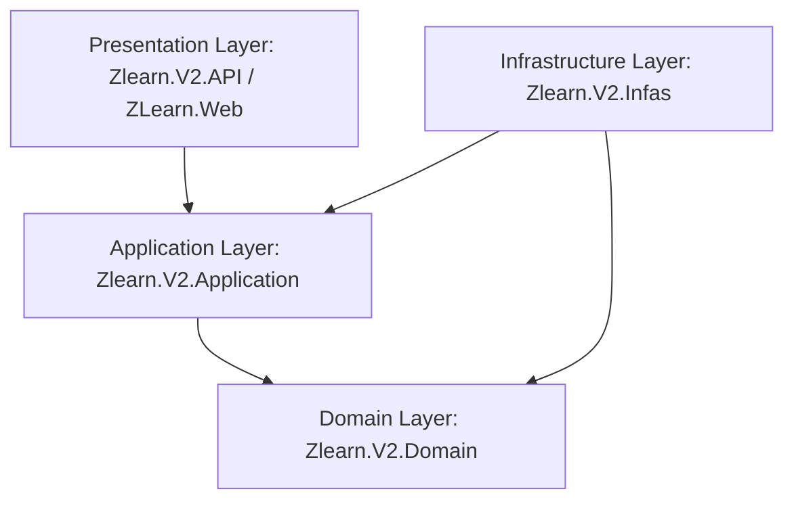
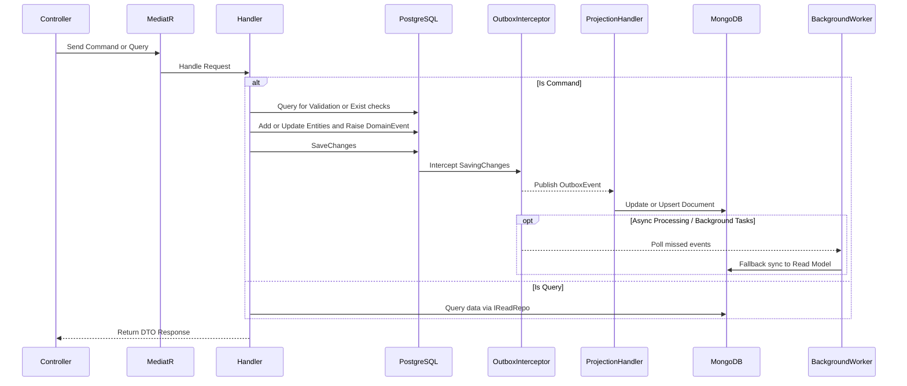
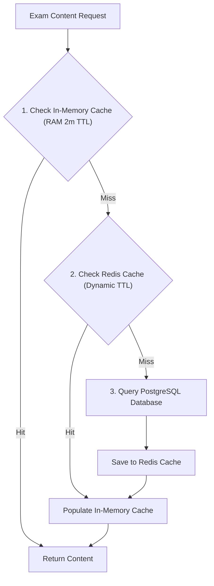
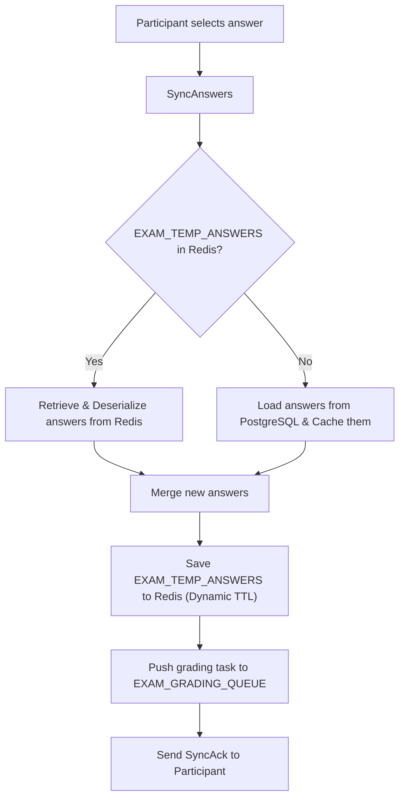
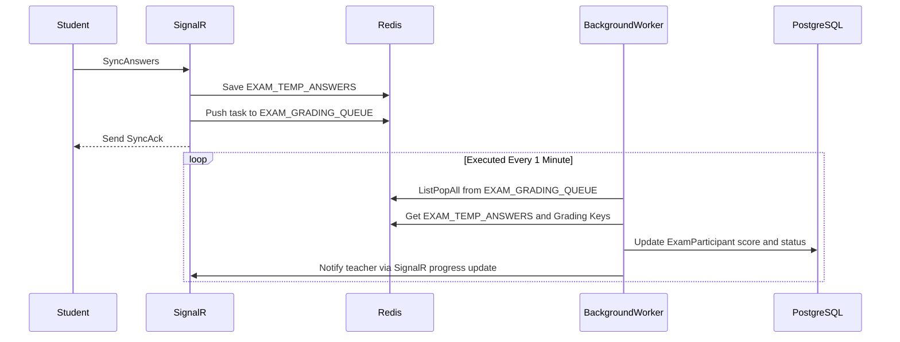

# ZLearn - Online Quiz and Exam System

A high-performance online quiz and exam platform built with ASP.NET Core 8.0/6.0, applying Clean Architecture, the CQRS Pattern, advanced Caching via Redis, and real-time synchronization via SignalR.

---

## Clean Architecture

The project follows the Clean/Onion Architecture model, separating concerns into 4 independent layers with a one-way dependency rule pointing towards the Domain core:



### 1. Domain Layer
*   **Responsibility**: Contains core business entities (Entities, Value Objects), business event interfaces (`IDomainEvent`), and invariant business rules.
*   **Core Components**:
    *   [BaseEntity](file:///d:/projects/zlearn/Zlearn.V2.Domain/Common/BaseEntity.cs) & [AuditableEntity](file:///d:/projects/zlearn/Zlearn.V2.Domain/Common/AuditableEntity.cs): Define entities with string-based IDs and automatic audit fields (`CreatedBy`, `Created`, `LastModifiedBy`, `LastModified`).
    *   [AggregateRoot](file:///d:/projects/zlearn/Zlearn.V2.Domain/Common/AggregateRoot.cs): Provides a mechanism to collect and raise business Domain Events (`RaiseEvent`, `ClearUncommittedEvents`).

### 2. Application Layer
*   **Responsibility**: Contains business logic flows (Use Cases), DTOs, Validators, and interface definitions for gateways (Repositories, Caching, Services).
*   **Core Components**:
    *   **CQRS MediatR**: Defines Commands/Queries and their corresponding Handlers.
    *   **AutoMapper**: Automatically maps between Entities and DTOs.

### 3. Infrastructure Layer
*   **Responsibility**: Implements interfaces defined in the Application layer. Manages database interactions (EF Core PostgreSQL, MongoDB), external services (Redis, Cloudinary, Groq AI), security, and Background Jobs (Quartz.NET, Hangfire).
*   **Core Components**:
    *   **Outbox Pattern**: [HandleEventsInterceptor](file:///d:/projects/zlearn/Zlearn.V2.Infas/Data/Interceptors/HandleEventsInterceptor.cs) intercepts domain events (`DomainEvent`) and persists them as `OutboxEvent` with `TransactionId` in PostgreSQL. [OutboxProcessorJob](file:///d:/projects/zlearn/Zlearn.V2.Infas/Data/Services/OutboxProcessorJob.cs) executes transaction-aware batch processing asynchronously to dispatch events to MongoDB without blocking HTTP requests.
    *   **Automated Retention Cleanup**: [OutboxCleanupBackgroundService](file:///d:/projects/zlearn/Zlearn.V2.Infas/Data/Services/OutboxCleanupBackgroundService.cs) periodically deletes processed outbox events older than 7 days for auditability and storage optimization.
    *   **MongoDB Projections**: Listens to `OutboxEvent` (`SyncExamToMongoHandler`, `SyncQuizToMongoHandler`, `SyncCategoryToMongoHandler`) to update and project data to MongoDB as the Read Model.

### 4. Presentation Layer
*   **Responsibility**: Entry points of the system (API Controllers, Razor Views, SignalR Hubs), cookie management, and authorization.

---

## CQRS Architecture

ZLearn separates read queries and write commands using MediatR:



### Highlights:
*   **Simple & Clean Validation Logic**: Validation checks are written directly inside Handlers throwing `ValidationErrorException` or `NotFoundException` to keep configuration minimal.
*   **Unified Folder Structure**: Commands and Queries are grouped by Use Case (e.g., `CreateExamCommand.cs` and `CreateExamCommandHandler.cs` reside in the same folder).
*   **Scaffolding Scripts**: Provides command-line tools to generate template boilerplate code:
    *   `create-command.bat [ModuleName] [ReturnType]`
    *   `create-query.bat [ModuleName] [ReturnType]`
    *   `create-event.bat [ModuleName] [PayloadType]`

---

## Caching Mechanism

ZLearn utilizes Redis as a distributed cache to boost performance, particularly for authentication and real-time exam sessions.

### 1. Redis Key Structure (RedisKeys)

| Key Constant | Redis Key Structure | Data Type | Description |
| :--- | :--- | :--- | :--- |
| `REFRESH_TOKEN` | `REFRESH_TOKEN:{UserId}` | String | Stores user Refresh Tokens, keeping TTL in sync |
| `REVOKED_ACCESS_TOKEN` | `REVOKED_ACCESS_TOKEN:{Token}` | String | Stores revoked access tokens (upon logout) |
| `EXAM_PARTICIPANT_MAP` | `EXAM_PARTICIPANT_MAP:{UserId}` | String | Maps UserId to the current active ExamId (Dynamic TTL until Exam EndTime) |
| `EXAM_SESSION_DISCONNECT` | `EXAM_SESSION_DISCONNECT:{UserId}` | String | Tracks temporary participant disconnections (`{ExamId}:{UnixTimestamp}`, 30-second TTL) |
| `EXAM_SESSION` | `EXAM_SESSION:{Token}` | Hash (Object) | Stores session details mapped to a cookie token (Dynamic TTL until Exam EndTime) |
| `EXAM_TEMP_ANSWERS` | `EXAM_TEMP_ANSWERS:{ExamId}:{UserId}` | String (JSON) | Caches active participant answers (Dynamic TTL until Exam EndTime) |
| `EXAM_GRADING_QUEUE` | `EXAM_GRADING_QUEUE:global` | List (Queue) | Queue of grading tasks processed asynchronously by a background worker |

### 2. Multi-Level Caching Architecture (MemoryCache + Redis)

For high-frequency read requests like Exam Content retrieval (`GetExamContentAsync`), ZLearn employs a 2-tier server-side cache (L1 In-Memory Cache + L2 Distributed Redis Cache):



### 3. Real-time Caching Flow in Exams

When a participant submits answers during an exam via [ExamHub](file:///d:/projects/zlearn/Zlearn.V2.Infas/External/SignalR/ExamHub.cs):



### 4. Asynchronous Grading Background Worker (ExamGradingBackgroundService)

To offload work from the main API thread, exam grading is handled asynchronously by a Background Task:



*   [ExamGradingBackgroundService](file:///d:/projects/zlearn/Zlearn.V2.Infas/Data/Services/ExamGradingBackgroundService.cs) runs every 1 minute.
*   **Workflow**:
    1.  Pops all grading tasks from `EXAM_GRADING_QUEUE:global` using `ListPopAll`.
    2.  Groups tasks by `{UserId, ExamId}` and keeps only the latest task to prevent redundant processing.
    3.  Loads the correct answers (Grading Keys) from Cache or DB.
    4.  Retrieves cached participant answers from `EXAM_TEMP_ANSWERS` (or DB fallback).
    5.  Calculates the score, marks the `ExamParticipant` as `Completed`, and updates PostgreSQL.
    6.  Notifies the exam host/teacher of progress updates via SignalR.

---

## Getting Started

### 1. Requirements
*   .NET SDK 8.0 or later
*   Docker & Docker Compose (for PostgreSQL, MongoDB, Redis)

### 2. Running the application
Create a `.env` file or use the default configurations:
```bash
docker-compose up -d
```
This launches PostgreSQL, MongoDB, and Redis instances.

### 3. Using Scaffolding Scripts
*   Open CMD/PowerShell in the project root directory.
*   Run `create-command.bat [CommandName] [ReturnType]` to generate a CQRS Command boilerplate.
