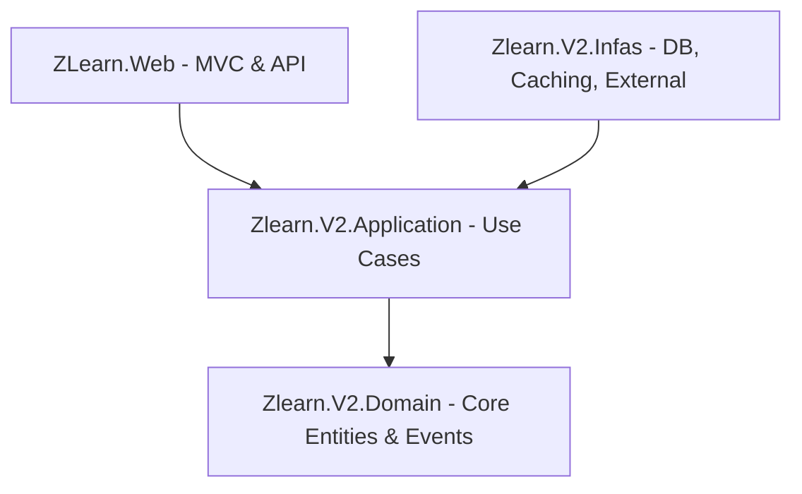

# Tổng quan Kiến trúc Hệ thống (Architecture Overview)

Dự án **ZLearn** được xây dựng dựa trên nguyên lý kiến trúc sạch (**Clean Architecture / Onion Architecture**). Kiến trúc này giúp tách biệt rõ ràng giữa logic nghiệp vụ (Core) và các yếu tố kỹ thuật như cơ sở dữ liệu, giao diện người dùng, và các thư viện bên ngoài.

---

## Cấu trúc các Lớp (Clean Architecture Layers)

Mã nguồn được tổ chức thành các project C# sau:

### 1. Lớp Nhân (Core) - [Zlearn.V2.Domain](file:///d:/projects/zlearn/Zlearn.V2.Domain)
- **Mô tả**: Đây là trung tâm của kiến trúc, độc lập hoàn toàn với các framework hay cơ sở dữ liệu bên ngoài.
- **Thành phần**: Được chia theo các Bounded Contexts (như `CatalogContext`, `ExamContext`, `FileContext`, `IdentityContext`) và thư mục `Common`. Chứa các thực thể (`Quiz`, `Question`, `Exam`, v.v.), AggregateRoots, Value Objects, Domain Events và cấu trúc định danh thực thể.
- **Đặc điểm**: Không tham chiếu đến bất kỳ project nào khác trong solution.

### 2. Lớp Ứng dụng - [Zlearn.V2.Application](file:///d:/projects/zlearn/Zlearn.V2.Application)
- **Mô tả**: Định nghĩa các nghiệp vụ cốt lõi của hệ thống (Use Cases) theo mô hình CQRS.
- **Thành phần**: Commands, Queries, Handlers, DTOs, Validators (FluentValidation), AutoMapper Profiles, và các interface trừu tượng như `IReadRepo<>` và `IWriteRepo<>`.
- **Đặc điểm**: Chỉ tham chiếu đến [Zlearn.V2.Domain](file:///d:/projects/zlearn/Zlearn.V2.Domain).

### 3. Lớp Cơ sở hạ tầng - [Zlearn.V2.Infas](file:///d:/projects/zlearn/Zlearn.V2.Infas)
- **Mô tả**: Hiện thực hóa (Implement) các interfaces định nghĩa ở lớp Application. Tương tác trực tiếp với Database, Cache, các dịch vụ bên ngoài (AI, Storage), và cung cấp các dịch vụ hệ thống nền.
- **Thành phần**: EF Core `AppDbContext` (PostgreSQL write model), MongoDB Read Repository implementation, Outbox Event Interceptors, Redis Service, Identity services, SignalR Hubs, Hangfire/Quartz Schedulers, Serilog.
- **Đặc điểm**: Tham chiếu đến [Zlearn.V2.Application](file:///d:/projects/zlearn/Zlearn.V2.Application) và [Zlearn.V2.Domain](file:///d:/projects/zlearn/Zlearn.V2.Domain).

### 4. Lớp Trình diễn (Presentation Layer)
- [ZLearn.Web](file:///d:/projects/zlearn/ZLearn.Web): Ứng dụng ASP.NET Core MVC (Razor views) đồng thời cũng đóng vai trò là API endpoint chính hỗ trợ realtime SignalR (đã tích hợp các REST API endpoints).

---

## Công nghệ Sử dụng (Technology Stack)

| Thành phần | Công nghệ / Thư viện chính |
| :--- | :--- |
| **Framework chính** | .NET 8.0 SDK |
| **Cơ sở dữ liệu Ghi (Write Db)** | PostgreSQL (truy xuất qua EF Core + Npgsql) |
| **Cơ sở dữ liệu Đọc (Read Db)** | MongoDB (truy xuất qua MongoDB.Driver và `IReadRepo<>` read repository) |
| **Đồng bộ PostgreSQL & MongoDB** | Transactional Outbox Pattern (qua `HandleEventsInterceptor` và `OutboxProcessorJob`) |
| **Caching** | Redis (qua StackExchange.Redis) và MemoryCache cục bộ |
| **CQRS / Mediator** | MediatR (đăng ký qua Assembly Scanning) |
| **Validation** | FluentValidation (xử lý tự động qua MediatR Pipeline Behavior) |
| **Ánh xạ Dữ liệu** | AutoMapper |
| **Xử lý Real-time** | ASP.NET Core SignalR (Access Tracking & Exam Tracking Hubs) |
| **Lập lịch & Tác vụ nền** | Quartz.NET (dùng Postgres Store), Hangfire (Memory Storage), IHostedService |
| **Đăng nhập / Phân quyền** | ASP.NET Core Identity, JWT Bearer Token, Cookie Authentication, Google OAuth |
| **Xuất Bản Đề Thi / Kết Quả** | QuestPDF, OpenXml (xử lý kết xuất tài liệu PDF & Word) |
| **Tích hợp AI** | Groq AI (Chat Completion) |
| **Lưu trữ Tệp** | Cloudinary Store API |
| **Logging** | Serilog (ghi Console & Rolling Files) + Custom LogMiddleware |

---

## Luồng Đi của Dữ liệu (Request/Data Flow)

1. **Request Client** gửi tới Controllers của `ZLearn.Web` (các trang Web Razor hoặc REST API).
2. **Controller** không trực tiếp gọi Business logic mà gửi một **Command** hoặc **Query** qua MediatR (`_mediator.Send(...)`).
3. **MediatR Pipeline** tự động chạy qua `ValidationBehaviour` để kiểm tra dữ liệu đầu vào.
4. **Handler** đón nhận Command/Query:
   - **Với Query**: Truy vấn dữ liệu cực nhanh từ MongoDB thông qua `IReadRepo<TDocument>`.
   - **Với Command**: Lấy entity từ PostgreSQL qua `IWriteRepo<TEntity>`, thực thi phương thức nghiệp vụ trên entity (nâng Domain Events), lưu thay đổi.
5. **DbContext Interceptor (Transactional Outbox)**: Khi Handler gọi `SaveChangesAsync()`:
   - `AuditableEntityInterceptor` tự động ghi nhận thời gian và người tạo/sửa đổi.
   - `HandleEventsInterceptor` tự động quét các Domain Events từ `AggregateRoot`, chuyển chúng thành các bản ghi `OutboxEvent` lưu vào PostgreSQL trong cùng một transaction.
6. Background Job (`OutboxProcessorJob`) sẽ quét các outbox event chưa xử lý, publish chúng qua MediatR để các handlers đồng bộ (sync) dữ liệu sang MongoDB và thực thi các tác vụ bất đồng bộ khác.
