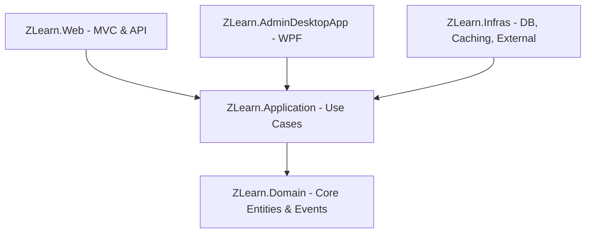

# Tổng quan Kiến trúc Hệ thống (Architecture Overview)

Dự án **ZLearn** được xây dựng dựa trên nguyên lý kiến trúc sạch (**Clean Architecture / Onion Architecture**). Kiến trúc này giúp tách biệt rõ ràng giữa logic nghiệp vụ (Core) và các yếu tố kỹ thuật như cơ sở dữ liệu, giao diện người dùng, và các thư viện bên ngoài.

---

## 🏗️ Cấu trúc các Lớp (Clean Architecture Layers)

Mã nguồn được tổ chức thành các project C# sau:

### 1. Lớp Nhân (Core) - [ZLearn.Domain](file:///d:/projects/zlearn/ZLearn.Domain)
*   **Mô tả**: Đây là trung tâm của kiến trúc, độc lập hoàn toàn với bất kỳ framework hay cơ sở dữ liệu nào.
*   **Thành phần**: Chứa các thực thể (Entities), Enum, Constants, các ngoại lệ nghiệp vụ (Exceptions), và Domain Events.
*   **Đặc điểm**: Không tham chiếu đến bất kỳ project nào khác trong solution.

### 2. Lớp Ứng dụng - [ZLearn.Application](file:///d:/projects/zlearn/ZLearn.Application)
*   **Mô tả**: Định nghĩa các nghiệp vụ cốt lõi của hệ thống (Use Cases) theo mô hình CQRS.
*   **Thành phần**: Commands, Queries, Handlers, DTOs, Validators (FluentValidation), AutoMapper Profiles, và các interface trừu tượng như `IAppDbContext`, `IBaseRepo<>`, `IQuizRepo`, v.v.
*   **Đặc điểm**: Chỉ tham chiếu đến [ZLearn.Domain](file:///d:/projects/zlearn/ZLearn.Domain).

### 3. Lớp Cơ sở hạ tầng - [ZLearn.Infras](file:///d:/projects/zlearn/ZLearn.Infras)
*   **Mô tả**: Hiện thực hóa (Implement) các interfaces định nghĩa ở lớp Application. Tương tác trực tiếp với Database, Cache, các dịch vụ bên ngoài (AI, Storage), và cung cấp các dịch vụ hệ thống nền.
*   **Thành phần**: EF Core AppDbContext, Repositories concrete classes, RedisService, Identity services, SignalR Hubs, Hangfire/Quartz Schedulers, Serilog.
*   **Đặc điểm**: Tham chiếu đến [ZLearn.Application](file:///d:/projects/zlearn/ZLearn.Application) và [ZLearn.Domain](file:///d:/projects/zlearn/ZLearn.Domain).

### 4. Lớp Trình diễn (Presentation Layers)
Gồm hai ứng dụng, cùng chia sẻ lớp nghiệp vụ cốt lõi:
*   [ZLearn.Web](file:///d:/projects/zlearn/ZLearn.Web): Ứng dụng ASP.NET Core MVC (có view, controller, asset) đồng thời cũng đóng vai trò là API endpoint chính hỗ trợ realtime SignalR (đã tích hợp các REST API endpoints).
*   [ZLearn.AdminDesktopApp](file:///d:/projects/zlearn/ZLearn.AdminDesktopApp): Ứng dụng quản trị dành cho máy tính (WPF) phát triển theo mô hình MVVM (CommunityToolkit.Mvvm).

---

## 🛠️ Công nghệ Sử dụng (Technology Stack)

| Thành phần | Công nghệ / Thư viện chính |
| :--- | :--- |
| **Framework chính** | .NET 8.0 SDK |
| **Cơ sở dữ liệu** | PostgreSQL (truy xuất qua EF Core + Npgsql) |
| **Caching** | Redis (qua StackExchange.Redis) |
| **CQRS / Mediator** | MediatR (đăng ký qua Assembly Scanning) |
| **Validation** | FluentValidation (xử lý tự động qua MediatR Pipeline Behavior) |
| **Ánh xạ Dữ liệu** | AutoMapper |
| **Xử lý Real-time** | ASP.NET Core SignalR (Access Tracking & Exam Tracking Hubs) |
| **Lập lịch & Tác vụ nền** | Quartz.NET (dùng Postgres Store), Hangfire (Memory Storage), IHostedService |
| **Đăng nhập / Phân quyền** | ASP.NET Core Identity, JWT Bearer Token, Cookie Authentication, Google OAuth |
| **Tích hợp AI** | Groq AI (Chat Completion) |
| **Lưu trữ Tệp** | Cloudinary Store API |
| **Giao diện Desktop** | WPF (.NET 8.0), CommunityToolkit.Mvvm |
| **Logging** | Serilog (ghi Console & Rolling Files) + Custom LogMiddleware |

---

## 🔄 Luồng Đi của Dữ liệu (Request/Data Flow)

1.  **Request Client** gửi tới Controllers của `ZLearn.Web` (các trang Web MVC hoặc REST API).
2.  **Controller** không trực tiếp gọi Business logic mà gửi một **Command** hoặc **Query** qua MediatR (`_mediator.Send(...)`).
3.  **MediatR Pipeline** tự động chạy qua:
    *   `ValidationBehaviour`: Quét qua toàn bộ Validator tương ứng. Nếu sai, ném ngay lập tức exception.
4.  **Handler** đón nhận Command/Query:
    *   Tương tác với database qua các Repositories (ví dụ: `IQuizRepo`, `IExamRepo`).
    *   Tác động dữ liệu vào các Domain Entity. Nếu Entity sinh ra các Event nghiệp vụ, Entity sẽ lưu chúng tại danh sách `Events` nội bộ.
5.  **DbContext Interceptor**: Khi Handler gọi `SaveChanges()` / `SaveChangesAsync()`:
    *   `AuditableEntityInterceptor` tự động ghi nhận thời gian và người tạo/sửa đổi.
    *   `DispatchEventsInterceptor` tự động lấy các Domain Events từ Entity, xóa chúng và publish qua MediatR để các EventHandlers xử lý bất đồng bộ.
6.  **Handler** trả về DTO tương ứng. Controller nhận kết quả và trả về cho Client.
